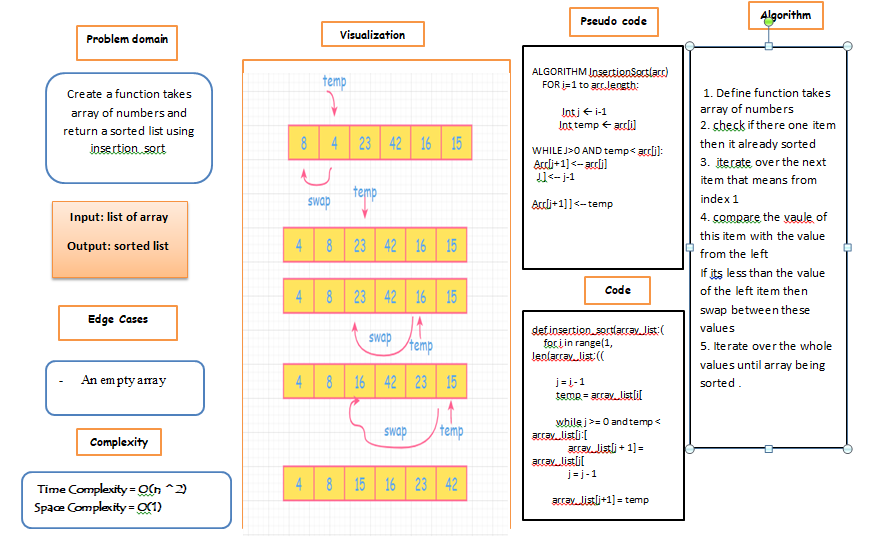

# Challenge Summary

Review the pseudocode of insertion sort , then trace the algorithm by stepping through the process with the provided sample array. Document your explanation by creating a blog article that shows the step-by-step output after each iteration through some sort of visual.

Once you are done with your article, code a working, tested implementation of Insertion Sort based on the pseudocode provided.

## Whiteboard Process

## Approach & Efficiency

Space complexity Big O(1)
Time complexity Big O(n^2)

## Solution
[code](insertion_sort/insertion_sort.py)
