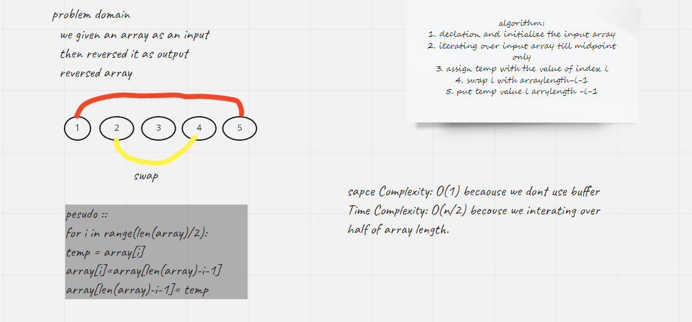

# Reverse an Array
<!-- Description of the challenge -->
In this challange we should Write a function called reverseArray which takes an array as an argument. Without utilizing any of the built-in methods available in python , return an array with elements in reversed order.

## Whiteboard Process
<!-- Embedded whiteboard image -->

## Approach & Efficiency
<!-- What approach did you take? Discuss Why. What is the Big O space/time for this approach? -->
i used recursion approach .
sapce Complexity: O(1) becaouse we dont use buffer
Time Complexity: O(n/2) becouse we interating over half of array length.
