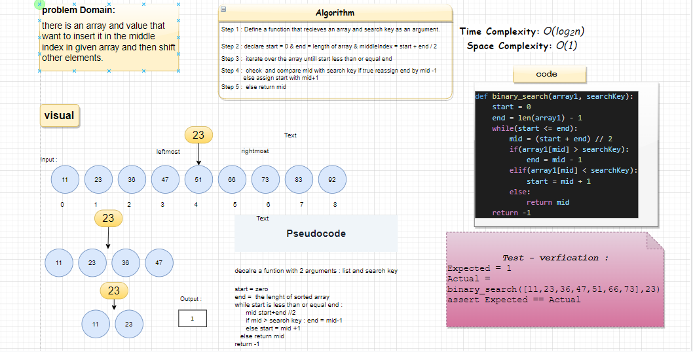

# Code Challange 03

## Binary Search of Sorted Array

Write a function called BinarySearch which takes in 2 parameters: a sorted array and the search key and returns the index of the array’s element that is equal to the value of the search key, or -1 if the element is not in the array.

input: a sorted array and the search key
output: intger number that indicates the index of sreach key , or -1 if that isnt in the array

## Whiteboard Process

## Approach & Efficiency

used search algorithm

<https://github.com/eslamakram/data-structures-and-algorithms/pull/22>
