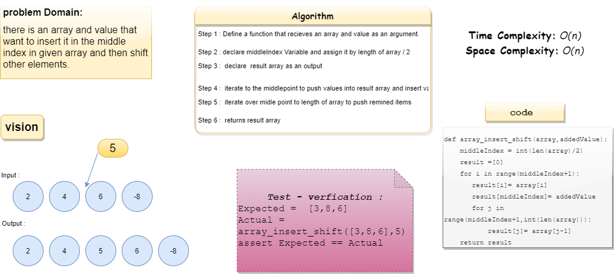

# Code Challange 02

## Insert to Middle of an Array

There is an array and value that want to insert it in the middle index in given array and then shift other elements.

## Whiteboard Process

## Approach & Efficiency

iterations and assign new array

<https://github.com/eslamakram/data-structures-and-algorithms/pull/22>
