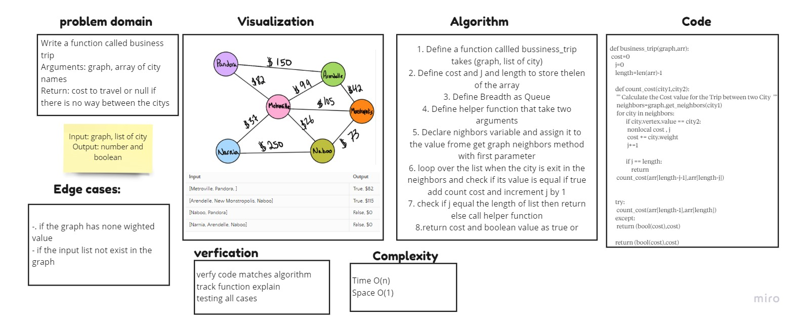

# graph-business trip

Given a business trip itinerary, and an Alaska Airlines route map, is the trip possible with direct flights? If so, how much will the total trip cost be?
## Whiteboard Process

## Approach & Efficiency

1. assures that there is no edge case that can happen at all
2. Define a counter and a boolean as True, the moment the boolean turns into false, this means that the trip can't be made.
3. get all the nodes, and get the nodes related to the array, then store them inside the new array
4. start a recursive function call, that takes two nodes at a time, determine if there is an edge between them, if exists, it adds the weight to the counter, if it doesn't exist, this will make bool false,
5. return false with $0 cost
6. return the total cost

### Big O

Time = O(n)

Space = O(1)

## Solution

[CODE](graph_business/graph_trip.py) | [TEST](tests/test_graph_business_trip.py)

