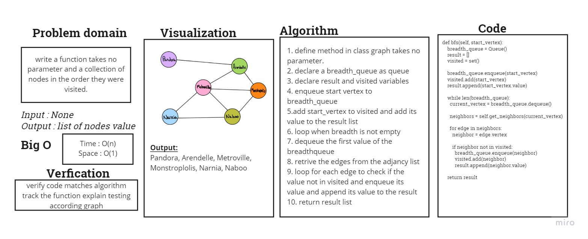

# graph-breadth-first

Implement a breadth-first traversal on a graph.

## Whiteboard Process

## Approach & Efficiency

1. define method in class graph takes no parameter.
2. declare a breadth_queue as queue
3. declare result and visited variables
4. enqueue start vertex to breadth_queue
5. add start_vertex to visited and add its value to the result list
6. Loop when breadth is not empty
7. dequeue the first value of the breadthqueue
8. retrive the edges from the adjancy list
9. loop for each edge to check if the value not in visited and enqueue its value and append its value to the result
10. return result list

### Big O

Time = O(n)

Space = O(1)

## Solution

[CODE](graph/graph.py) | [TEST](tests/test_graph.py)
