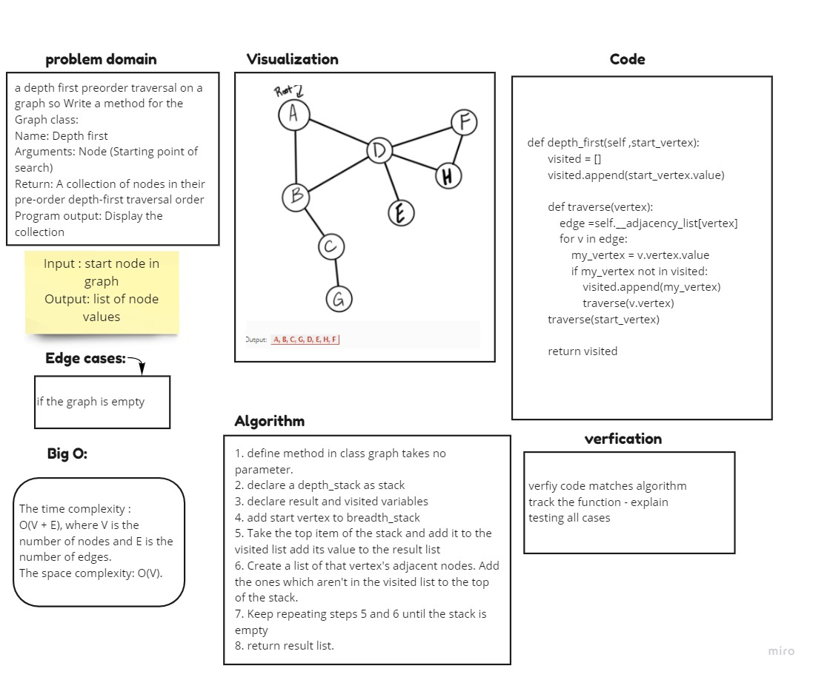

# graph-depth-first

Implement a depth-first traversal on a graph.

## Whiteboard Process

## Approach & Efficiency

1. define method in class graph takes no parameter.
2. declare visited variable
3. add start vertex to visited
4. Take the top item of the stack and add it to the visited list 
5. Create a list of that vertex's adjacent nodes. Add the ones which aren't in the visited list to the top of the stack.
6. Keep repeating steps 4 and 5 until the stack is empty
7. return visited

### Big O

Time = O(n)

Space = O(1)

## Solution

[CODE](graph/graph.py) | [TEST](tests/test_graph.py)

