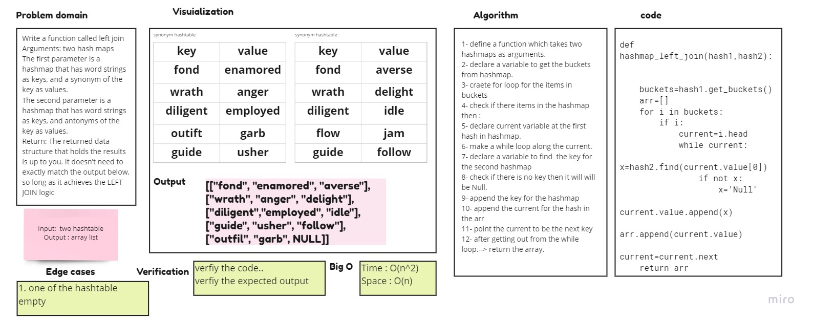

# Hashmap LEFT JOIN

Implement a simplified LEFT JOIN for 2 Hashmaps.

## Challenge

+ Write a function called left join
+ Arguments: two hash maps
+ The first parameter is a hashmap that has word strings as keys, and a synonym of the key as values.0
+ The second parameter is a hashmap that has word strings as keys, and antonyms of the key as values.
+ Return: The returned data structure that holds the results is up to you. It doesn’t need to exactly match the output below, so long as it achieves the LEFT JOIN logic

## Whiteboard

## Approach & Efficiency

    1- define a function which takes two hashmaps as arguments.
    2- declare a variable to get the buckets from hashmap.
    3- craete for loop for the items in buckets
    4- check if there items in the hashmap
    5- declare current variable at the first hash in hashmap.
    6- make a while loop along the current.
    7- declare a variable to find  the key for the second hashmap
    8- check if there is no key then it will will be Null.
    9- append the key for the hashmap
    10- append the current for the hash in the arr
    11- point the current to be the next key
    12- after getting out from the while loop.--> return the array.

### Complexity

    Time O(n^2)
    Space O(n)

## Solution

[CODE](/hashmap_left_join/left_join.py) | [TEST](tests/test_hashmap_left_join.py)
