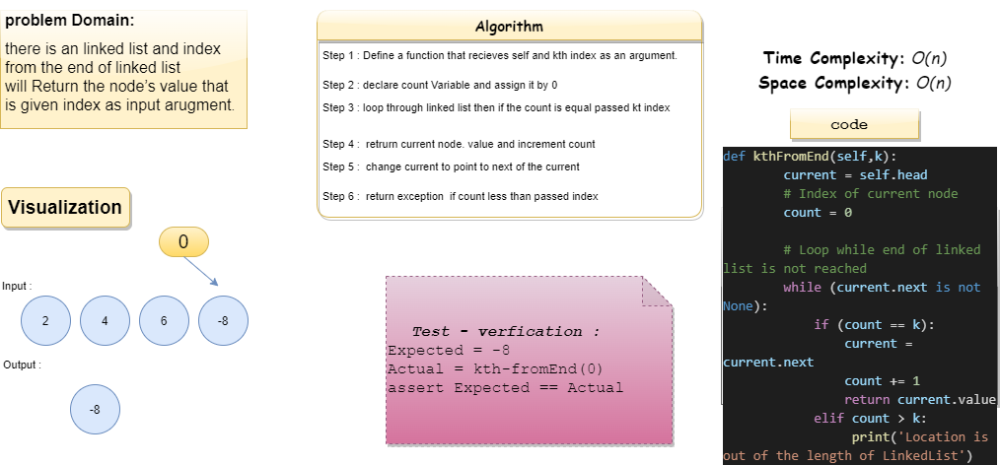
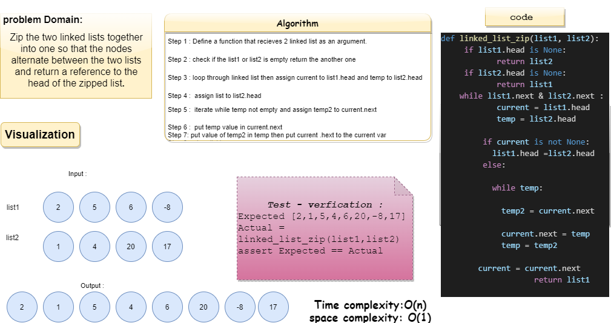

# Challenge Summary

singly linked-list challenges:
**Nov 7, 2021**

  1. append method to insert new node to linked list
  2. insert a new value after a value given as argument
  3. insert a new value before a value given as argument

**Nov 8, 2021**
kth from end: k-th value from the end of a linked list

Input argument: a number, k, as a parameter.
Output : Return the node’s value that is k places from the tail of the linked list.

**Nov 9, 2021**
Zip the two linked lists together into one so that the nodes alternate between the two lists and return a reference to the head of the zipped list.

Input: 2 linked lists
Output: Linked List zipped

## Whiteboard Process

## Approach & Efficiency

The approach was searching for the value with while loop.
Big O: O(n).

## Solution

1. git clone
2. poetry shell
3. poetry install
4. pytest or python (linked_list_insertions/linked_list_insertions.py)

## Code Implementation

[Linked List](linked_list_insertions/linked_list_insertions.py)

[Tests Implementation](tests/test_linked_list_insertions.py)
