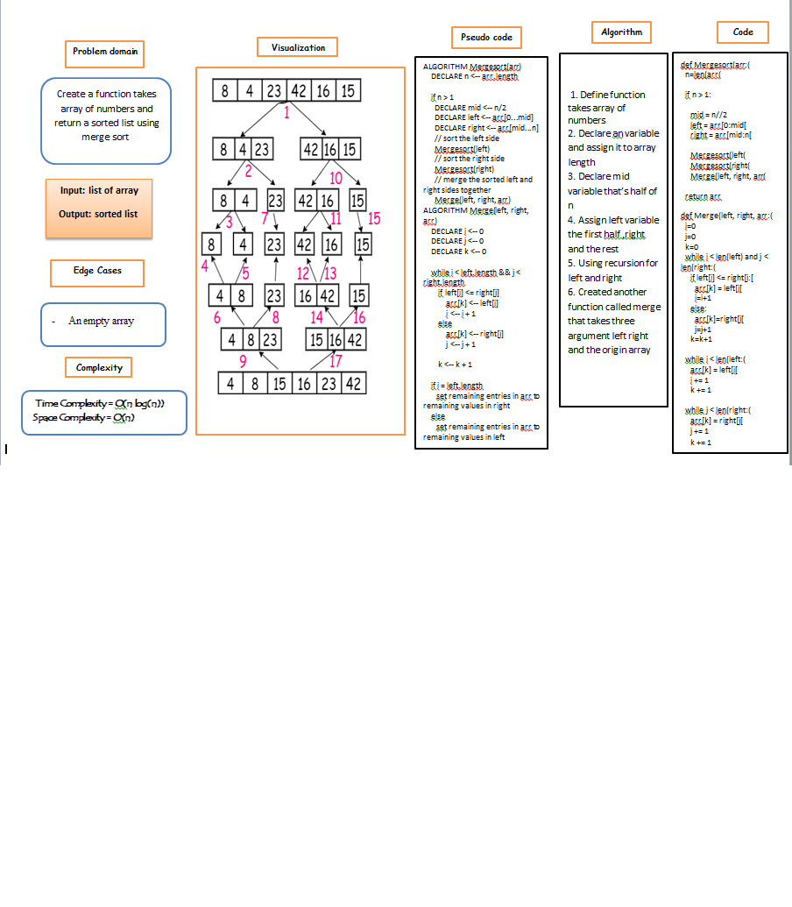

# Challenge Summary

Write a function that take a list then sort it using merge sort

## Whiteboard Process



## Approach & Efficiency

+ Ceate function take array of numbers as arg
+ declear n equal the length of array
+ let mid half of n
+ let left the first half and right the seconde half
+ clal the function again with left and right
+ after that create new function called merge take three argument left, right and the orgnal array
+ call merge with the left, right and array

### Complexity

+ Time Complexity = O(n log(n))

+ space Complexity = O(n)

## Solution

```bash
def Mergesort(arr):
  n=len(arr)

  if n > 1:

    mid = n//2
    left = arr[0:mid]
    right = arr[mid:n]

    Mergesort(left)
    Mergesort(right)
    Merge(left, right, arr)

  return arr

def Merge(left, right, arr):
  i=0
  j=0
  k=0
  while i < len(left) and j < len(right):
    if left[i] <= right[j]:
      arr[k] = left[i]
      i=i+1
    else:
      arr[k]=right[j]
      j=j+1

    k=k+1

  while i < len(left):
    arr[k] = left[i]
    i += 1
    k += 1

  while j < len(right):
    arr[k] = right[j]
    j += 1
    k += 1
```
